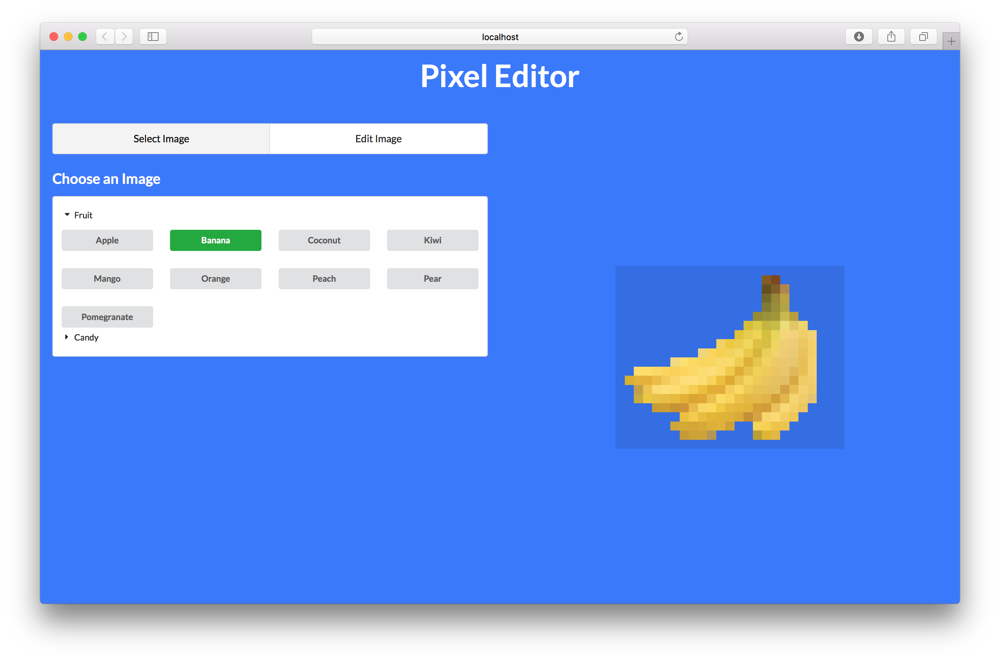
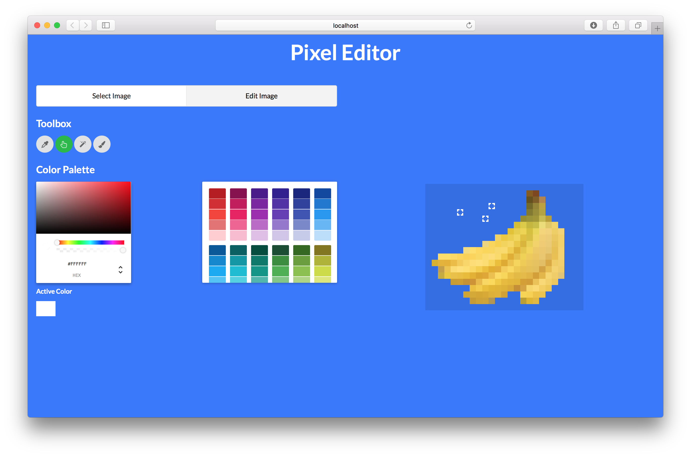
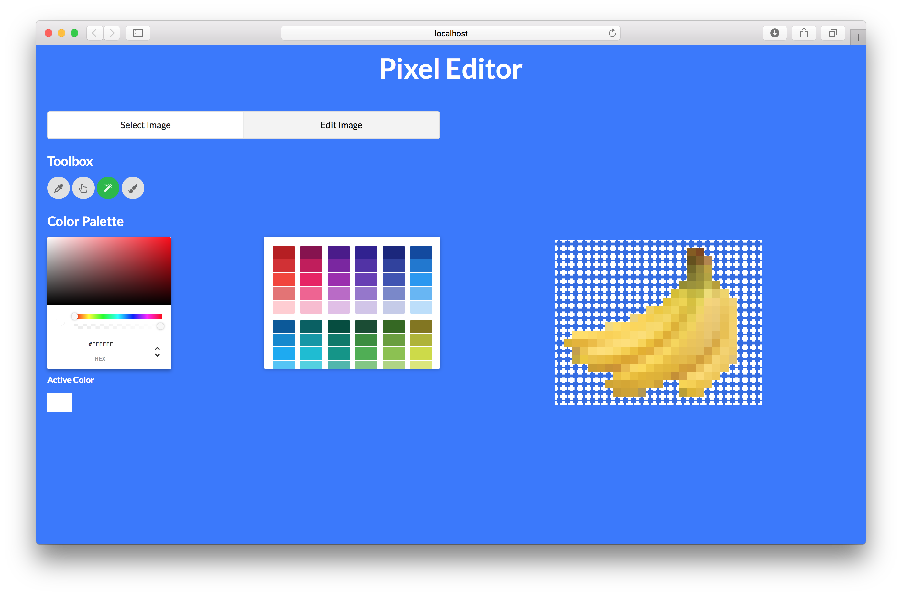
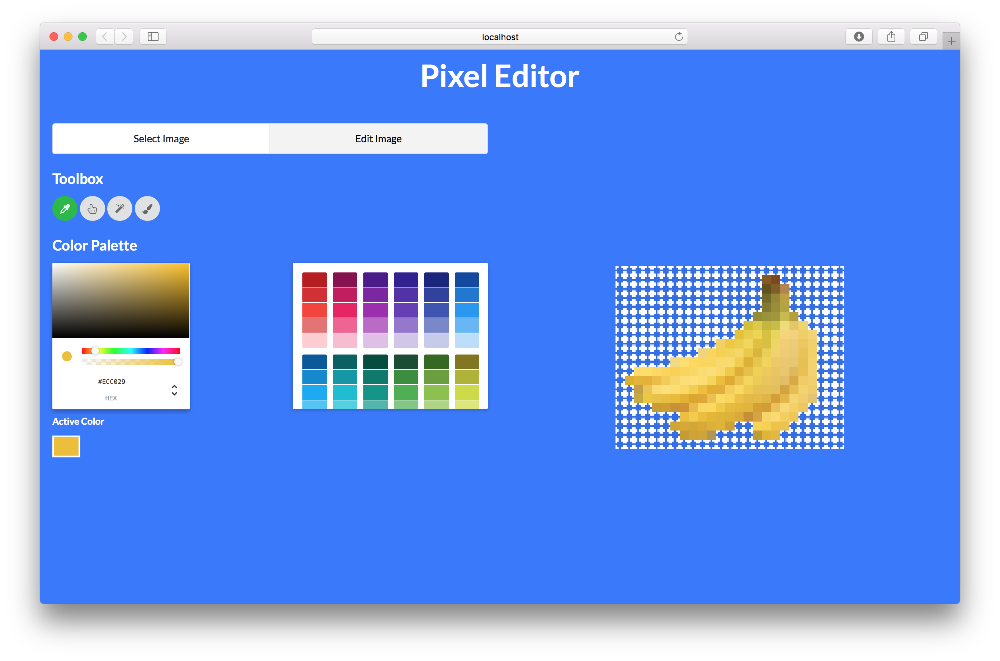
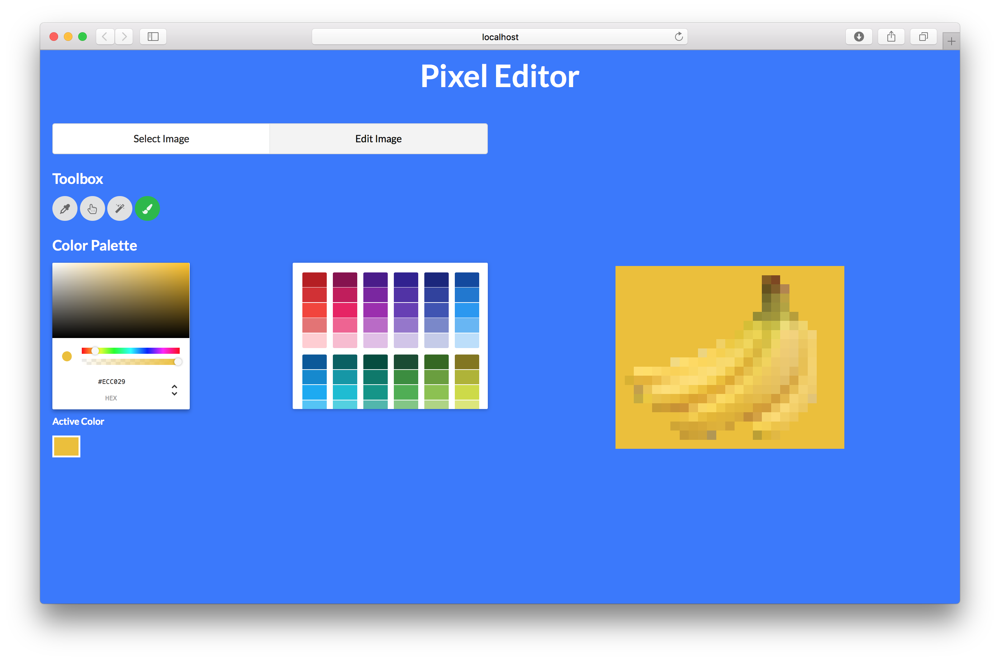

# PixelsWithReact

Created by Andre Askarinam over Winter Break 2016-2017.

## Description

This is a basic small picture editor created completely with React.js on top of a Flask API that takes stored `png` photos and returns their pixel matrices if requested. All the code is open-sourced and available at your disposal.

## Functionality

The user can first choose among an array of images to edit. For example, the banana. 



Then, can switch to the 'Edit Image' panel and choose among several tools. The 'Hand' tool allows users to select individual pixels directly on the image displayed.



The 'Magic Wand' tool allows users to select all adjacent pixels of the same color.



The 'Eye Dropper' tool allows users to select a pixel's color as the active color.



Finally, using the 'Paintbrush' tool, users can dump the active color onto all the selected pixels.



## Usage

You must run the Flask API and the node app separately (both running by default on different ports). The Flask API requires packages help by pip in the virtual environment provided.

Flask API:
```
$ source pixels-env/bin/activate
$ cd flask-api/
$ python api.py
* Running on http://127.0.0.1:5000/ (Press CTRL+C to quit)
```

Node App:
```
$ cd pixels-ui/
$ npm start
```

## Future Possible Additions

As of right now there is limited support and functionality (due to lack of applicability of this small editor). This is mainly a showcase, but can be extended in the future to suit the following features:
- Import/Export of photos
- Better selection tools
    + Dragging via "Pixel Selector" tool
    + Laso tool
-  Zoom in/out of photos 

